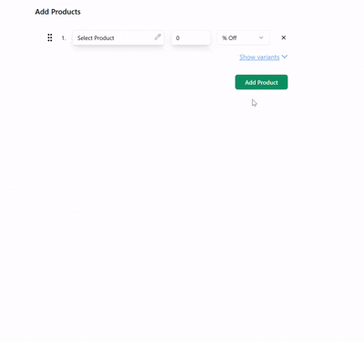
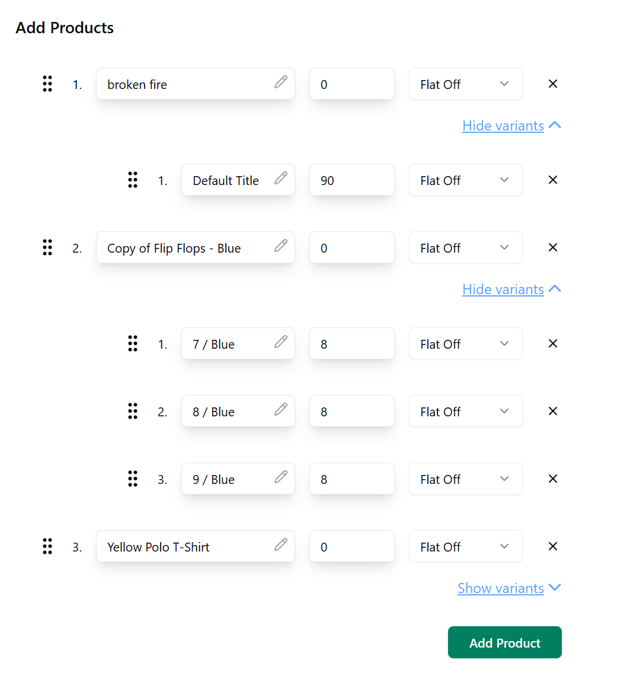

# 🛒 Monk Commerce

This project was built as part of an interview assignment, and it truly inspired me to level up my front-end engineering skills. From user experience to performance optimizations, every decision was made with care and intent.
 

## 🚀 Tech Stack & Key Highlights

- 🧩 **ShadCN + TailwindCSS** — for a modern, clean, and consistent UI experience
- ✅ **TypeScript** — for type safety and better DX (developer experience)
- 🧠 **useCallback & memoization** — to prevent unnecessary re-renders and boost performance
- 🔄 **react-infinite-scroll-component** — for seamless infinite pagination
- 🖱️ **react-dnd** — to implement smooth and accessible drag-and-drop reordering
- ⏱️ **Debounced Search** — for efficient filtering and reduced API load while typing

---

## ❤️ What I Loved About This Challenge

This assignment was more than just building a feature — it challenged me to think like a product engineer:
- I focused on user experience, edge cases, and scalability
- Explored better state and component optimization patterns
- Built a clean and extensible UI that’s also dev-friendly

---

## 📷 Preview







---

## 📂 How to Run

```bash
git clone https://github.com/your-username/your-repo-name.git
cd your-repo-name
npm install
npm run dev
